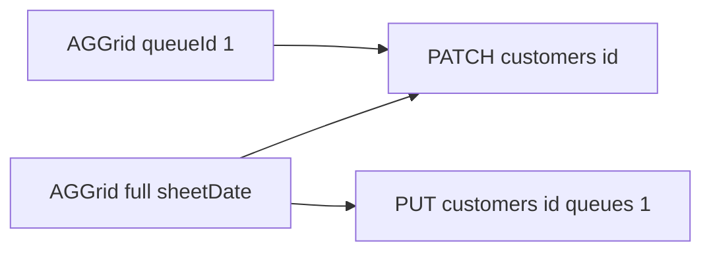

# Tích hợp React + AG Grid với Quay27-Be

## API hiện có (đủ cho sheet + Quầy 27)

| Mục đích                               | Method | Endpoint                                        | Ghi chú                                                                                                                                                                |
| -------------------------------------- | ------ | ----------------------------------------------- | ---------------------------------------------------------------------------------------------------------------------------------------------------------------------- |
| Đăng nhập                              | POST   | `/api/auth/login`                               | Body JSON: `{ "username", "password" }` → `[TokenResponse](d:\Quay27\Quay27-Be\Quay27.Application\Auth\TokenResponse.cs)` (`accessToken`, `expiresAtUtc`, `tokenType`) |
| Danh sách khách theo ngày (full sheet) | GET    | `/api/customers?sheetDate=YYYY-MM-DD`           | Không truyền `queueId` → tất cả dòng của ngày đó                                                                                                                       |
| Danh sách chỉ Quầy 27                  | GET    | `/api/customers?sheetDate=YYYY-MM-DD&queueId=1` | `[SchemaConstants.Quay27QueueId](d:\Quay27\Quay27-Be\Quay27.Domain\Constants\SchemaConstants.cs)` = `1`                                                                |
| Chi tiết 1 dòng                        | GET    | `/api/customers/{id}`                           |                                                                                                                                                                        |
| Tạo dòng                               | POST   | `/api/customers`                                | Body khớp `[CreateCustomerRequest](d:\Quay27\Quay27-Be\Quay27.Application\Customers\CreateCustomerRequest.cs)` (đủ 16 field nghiệp vụ + `sheetDate` + `status`)        |
| Sửa từng phần (auto-save / ô)          | PATCH  | `/api/customers/{id}`                           | Body khớp `[UpdateCustomerRequest](d:\Quay27\Quay27-Be\Quay27.Application\Customers\UpdateCustomerRequest.cs)` — chỉ gửi field đổi; `null` = không đổi                 |
| Xóa mềm                                | DELETE | `/api/customers/{id}`                           | Chỉ **Admin** (`[CustomerService](d:\Quay27\Quay27-Be\Quay27.Application\Services\CustomerService.cs)`)                                                                |
| Tick **CẤP 27** (full → Quầy 27)       | PUT    | `/api/customers/{id}/queues/1`                  | Body `{ "enrolled": true }` hoặc `false` — `[SetCustomerQueueRequest](d:\Quay27\Quay27-Be\Quay27.Application\Customers\SetCustomerQueueRequest.cs)`                    |
| Danh sách queue (dropdown)             | GET    | `/api/queues`                                   | `[QueueDto](d:\Quay27\Quay27-Be\Quay27.Application\Queues\QueueDto.cs)`                                                                                                |
| Seed demo (admin)                      | POST   | `/api/setup/demo-data`                          | `[SetupController](d:\Quay27\Quay27-Be\Controllers\SetupController.cs)` — xem [README](d:\Quay27\Quay27-Be\README.md)                                                  |

**Header:** mọi request (trừ login): `Authorization: Bearer <accessToken>`.

**Cột sheet ↔ DTO:** map trực tiếp property PascalCase trong `[CustomerDto](d:\Quay27\Quay27-Be\Quay27.Application\Customers\CustomerDto.cs)` (AG Grid thường dùng `field` trùng JSON camelCase từ serializer mặc định ASP.NET — kiểm tra `JsonNamingPolicy` hoặc cấu hình client).

**CẤP 27 trên UI:** cột checkbox “CẤP 27” bind với `queueIds` có chứa `1` (hoặc gọi GET sau PATCH queue); khi user tick → `PUT .../queues/1` với `enrolled: true`; bỏ tick → `false`.

---

## Khoảng trống backend: màn **tạo nhân viên**

Hiện **không** có `GET/POST/PATCH /api/users`, gán role, hay CRUD `ColumnPermissions` qua HTTP — chỉ có seed `[DatabaseSeeder](d:\Quay27\Quay27-Be\Quay27.Infrastructure\Persistence\DatabaseSeeder.cs)` + `[DemoDataSeedService](d:\Quay27\Quay27-Be\Quay27.Infrastructure\Persistence\DemoDataSeedService.cs)`.

**Hướng xử lý trong dự án FE:**

1. **Ngắn hạn:** màn “nhân viên” chỉ hướng dẫn admin dùng seed / quản lý DB; hoặc form “giả” gọi tới endpoint bạn sẽ thêm sau.
2. **Đúng nghiệp vụ:** mở rộng Quay27-Be (gợi ý) — Admin-only:
  - `POST /api/users` (username, password, fullName, roleIds)
  - `GET /api/users` (list)
  - `PUT /api/users/{id}/column-permissions` hoặc matrix theo `[ColumnPermission](d:\Quay27\Quay27-Be\Quay27.Domain\Entities\ColumnPermission.cs)` + tên cột từ `[SchemaConstants.CustomerColumns](d:\Quay27\Quay27-Be\Quay27.Domain\Constants\SchemaConstants.cs)`

Khi đó React form + bảng phân quyền cột mới có API thật.

---

## Phân quyền cột khi render AG Grid (staff)

`[CustomerService](d:\Quay27\Quay27-Be\Quay27.Application\Services\CustomerService.cs)`: **Admin** bỏ qua kiểm tra cột; **Staff** cần `CanEdit` trong DB cho từng cột, nếu không → `403` kèm message.

Backend **chưa** expose API “quyền của tôi”. FE có thể:

- **Cách A:** Thêm `GET /api/me/customer-column-permissions` (trả về list `{ columnName, canView, canEdit }`) — khuyến nghị cho UX tốt với `columnDefs` / `editable`.
- **Cách B:** Tạm thời set `editable: true` và bắt lỗi 403 từ PATCH (kém UX).

---

## Việc làm theo từng màn React

### 1. Chung (app shell)

- Base URL API (env `VITE_API_URL` / tương đương), axios/fetch wrapper gắn Bearer, refresh hoặc redirect login khi 401.
- Trang login → `POST /api/auth/login` → lưu token (memory + optional refresh strategy).
- CORS: bật trên Kestrel cho origin dev của React nếu cần.

### 2. Màn **full thông tin** (AG Grid)

- State `sheetDate` (tab theo ngày): `GET /api/customers?sheetDate=...`.
- `columnDefs`: 14 cột nghiệp vụ + cột **CẤP 27** (checkbox) đọc/ghi qua `queueIds` + `PUT .../queues/1`; có thể thêm cột `isDuplicate` (highlight).
- Inline edit: `onCellValueChanged` → build object PATCH chỉ field đổi (map `field` → đúng tên API).
- Kiểu cột: checkbox cho `managerApproved`, `kio27Received`, `export27`; datetime cho `billCreatedAt`; `date` cho `sheetDate` nếu component hỗ trợ.
- Auto-save: debounce PATCH; xử lý lỗi validation / 403 từ `[ExceptionHandlingMiddleware](d:\Quay27\Quay27-Be\Middleware\ExceptionHandlingMiddleware.cs)` (ProblemDetails).

### 3. Màn **Quầy 27** (AG Grid)

- Cùng `columnDefs` có thể tái sử dụng (component shared).
- Data: `GET /api/customers?sheetDate=...&queueId=1`.
- Không bắt buộc hiện cột CẤP 27 (đã trong queue); có thể vẫn cho “bỏ khỏi quầy” → `enrolled: false`.

### 4. Màn **tạo nhân viên**

- **Sau khi có API users (khuyến nghị):** form username/password/fullName, chọn role Admin|Staff; màn phụ chỉnh `ColumnPermissions` theo user.
- **Trước đó:** placeholder + link tài liệu seed + ghi rõ “API đang thiếu”.

### 5. Swagger / contract

- Dùng Swagger tại `/swagger` (Development) để sinh type TypeScript (openapi-typescript) hoặc copy type thủ công từ các record C# trên.

---

## Thứ tự triển khai gợi ý

1. Auth + wrapper + 1 grid đọc `GET customers` (full).
2. PATCH inline + debounce.
3. Cột CẤP 27 + `PUT queues/1`.
4. Route/màn Quầy 27 với `queueId=1`.
5. (BE) Users + column permissions API → form nhân viên.
6. (BE hoặc FE) Endpoint permissions cho `editable` chính xác từng staff.

